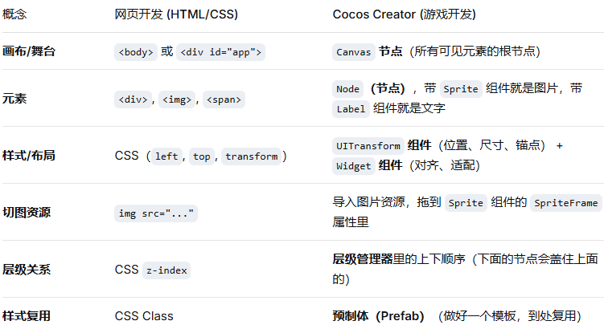

# 词条

## 概念

“词条”通常指装备或技能附带的具体属性效果，例如“攻击力 +10%”“暴击率 +5%”。

把“词条”理解成：**附加在角色、装备或技能上的一条具体效果描述**。

```text
例如玩家捡到一把剑：
	铁剑
    	基础攻击力：20

    词条：
        攻击力 +5
        暴击率 +10%
        击败敌人后恢复 2 点生命

换成实际战斗：
	没有词条：每次攻击造成 20 点伤害
    攻击力 +5：每次攻击造成 25 点伤害
    暴击率 +10%：有一定概率造成更高伤害
    击杀回血：打死敌人后恢复生命

同一种铁剑也可以随机生成不同词条：
	铁剑 A：攻击力 +5
	铁剑 B：攻击速度 +8%
	铁剑 C：攻击时有 10% 概率造成燃烧
	这就是很多游戏所说的“刷词条”：玩家不断获取装备，希望得到更适合自己玩法的附加效果。
```

## 关注焦点

```text
(1)游戏词条有哪些？

(2)玩家词条状态？
	private readonly affixLevels: AffixLevels = {
		// 词条id : 等级
		// 表示：强力弹头 Lv.2
		power: 2;
        piercing: 1
	};

(3)最终战斗属性？
	buildBattleStats(this.affixLevels) = 
        {
            damage: 24, 				// 每颗子弹初始造成 24 点伤害
            fireRate: 2.2, 				// 每秒射击 2.2 次
            critRate: 0.05, 			// 初始暴击率 5%
            critMultiplier: 2, 			// 暴击造成双倍伤害
            penetration: 0, 			// 没有穿透词条时，只命中第一个敌人
            highHealthBonus: 0, 		// 默认没有高血量目标增伤
            burstEvery: 0, 				// 0 表示默认不触发累计射击爆炸
            burstDamage: 0, 			// 默认没有爆炸伤害
            burstRadius: 88, 			// 获得爆破词条后使用的范围半径
            projectileCount: 1, 		// 默认每次只发射一颗子弹
            projectileDamageScale: 1, 	// 默认单颗子弹造成 100% 伤害
            slowRate: 0, 				// 默认不减速
            slowDuration: 0, 			// 默认没有减速持续时间
        }
```

## 词条分类

### 数值词条

```text
只改变已有数字，不增加新的战斗流程。

例如：
	伤害 +25%
	射速 +20%
	暴击率 +12%

实现重点是统一数值叠加规则。
```

### 条件词条

```text
某个时间点判断条件。

例如“目标生命高于 70% 时伤害 +50%”，必须在命中具体敌人时判断。它不能在角色面板上直接计算成一个永远生效的伤害值。

常见条件还有：
	- 自己生命低于 30%
	- 敌人处于燃烧状态
	- 与目标距离超过 300
	- 本次攻击是技能伤害
	- 当前场上敌人超过 20 个
```

### 机制词条

```text
会改变原来的事件流程或产生新对象。

例如：
    - 穿甲弹改变子弹能命中多少次。
    - 分裂枪口改变一次攻击创建多少颗子弹。
    - 十发爆破监听射击计数并创建范围伤害事件。
    - 低温弹药给敌人添加一个持续状态。

机制词条通常比纯数值词条更容易出现程序错误，也更需要单独测试。
```

# 快速入门



```
https://www.cnblogs.com/gamedaybyday/category/2310789.html

https://gitcode.com/sanchong/SnakeGame

素材：
	https://store.cocos.com/app/detail/3004

项目 -> 项目设置 (750 X 1334)

理解：
	节点是场景里的对象单位，节点负责承载，组件负责功能。组件按需安装，便于复用、拓展等。
	资源管理器就是找材料的地方；场景编辑器就是把场景中的内容用材料可视化搭建出来的地方。

事件：
	思路：
		1.先按钮节点，然后这个节点有button组件；
		
		2.脚本代码
			创建一个管理脚本的【空节点】GameRoot，将脚本拖动到这个节点下面
			
		3.把按钮和脚本方法关联起来
			点击按钮找到cc.button的Click Events；
			参数依次是：管理脚本的空节点GameRoot名称;  脚本名称; 脚本中需要触发的方法


脚本：
	// @property 将这个属性 显示到属性检查器
	// 那么可以将某一个Label节点与这个属性绑定，代码中就可以直接操作这个Label组件
	@property({ type: Label, tooltip: '游戏结束后的得分标签' })
	scoreResultLabel: Label = null;

预制体创建
	先在资源管理器中创建一个文件夹prefabs；
	然后把节点拖入文件夹就成了预制体
```

# 待处理

不求甚解，边学边忘很正常，用到在查！

```text
游戏两部分：视觉特效、玩法逻辑两部分

视觉特效 = 素材 + 组件配置 + 少量控制代码
	素材决定"长什么样";
	组件决定"怎么显示、怎么变化";
	代码决定"什么时候播放、在哪里播放、播放多久"
	
	例如一个激光效果：
		素材
		├─ 激光核心图片
		├─ 外层光晕图片
		├─ 枪口闪光序列帧
		└─ 命中火花序列帧

		组件
		├─ Sprite：显示激光图片
		├─ Animation：播放枪口和命中动画
		├─ ParticleSystem：生成火花、烟雾
		└─ Material：实现发光、流动、扭曲

		代码
		├─ 计算发射点和命中点
		├─ 调整激光长度与角度
		├─ 触发各种动画和粒子
		└─ 延迟隐藏或回收到对象池
	
玩法逻辑
	操作逻辑：移动、瞄准、攻击、释放技能
	规则逻辑：伤害、冷却、暴击、碰撞、胜负
	状态逻辑：生命、能量、等级、金币、Buff
	敌人逻辑：索敌、追击、攻击、逃跑
	关卡逻辑：刷怪、波次、倒计时、Boss 出现
	成长逻辑：升级、装备、技能选择
	存档逻辑：记录进度、恢复数据
	经济逻辑：奖励、购买、消耗和掉落

【项目结构】
    assets/                    # Cocos 项目的全部游戏资源
      scripts/                 #【怎么运行】TypeScript 游戏逻辑脚本
        battle/                # 战斗流程、波次、伤害和胜负逻辑
        skills/                # 武器、技能、子弹和技能升级逻辑
        enemies/               # 普通敌人、Boss、移动和受伤逻辑
        pools/                 # 敌人、子弹、特效等对象池
        ui/                    # 血条、技能选择、暂停和结算界面逻辑
        data/                  # 怪物、技能、关卡配置及玩家存档
      prefabs/                 #【对象模板】敌人、子弹、特效和UI的预制体模板
      textures/                #【图片外观】角色、敌人、背景、图标等图片资源
      animations/              #【怎么运动】序列帧、AnimationClip和Spine动画
      effects/                 #【视觉表现】粒子、材质、Shader和视觉特效

场景
	1.初始化配置、存档、SDK  Boot.scene
    2.登录/启动是一个 		 Login.scene
    3.大厅整体是一个 		 Lobby.scene
    4.真正战斗是一个独立     Battle.scene	

【动画】

图片帧动画
	几张图片 先通过 动画编辑器搞一个动作的帧动画(比如走路) + 然后加TS脚本进行位移(比如向前跑出一段距离等)

骨骼动画
	https://zh.esotericsoftware.com

Cocos 粒子动画
	https://www.71squared.com/particledesigner
	https://tidys.github.io/cc-particle-online/main.html
	
	Effekseer
		https://effekseer.github.io/zh-cn/index.html
	
	请为【引擎/项目】制作一个【特效名称】。

		使用场景：
			- 什么时候触发
			- 持续多久
			- 镜头距离/视角
			- 是否需要循环

		视觉表现：
			- 整体感觉
			- 颜色
			- 形状和运动
			- 出现、高潮、消散分别是什么样
			- 希望突出什么，避免什么

		技术要求：
			- 引擎及版本
			- 渲染管线
			- 使用粒子系统 / Shader / 序列帧 / 组合方案
			- 目标平台和性能预算
			- 允许新增哪些资源或插件
			- 需要暴露哪些可调参数

		参考：
			- 图片、视频、游戏名或已有特效路径
			- 参考它的哪些部分

		交付与验收：
			- 需要直接修改项目还是提供方案
			- 从哪个场景或按钮预览
			- 达到什么效果算完成


MVP【最小可行产品】
	

https://www.autodesk.com.cn/products/3ds-max/overview
```

```
登录、网络、热更新、支付、装备、任务、商城或复杂框架
```

# 项目如何进行？

注意：场景、Prefab 和资源文件后续通过 Cocos Creator 编辑器创建，避免生成无效 UUID 与 `.meta` 数据。

```
推荐按这个顺序推进：
    明确核心玩法
        确定玩家是否固定、怪物进攻方向、武器攻击方式、关卡时长、技能三选一等核心规则，先形成一页玩法说明。

    建立基础场景
        创建 Boot.scene、Lobby.scene、Battle.scene，完成设计分辨率、安全区、战斗层级和 UI 层级。

    配置数据规范
        先定义 monster、weapon、stage、skill 四类配置。统一 ID、字段类型、资源路径和版本规则，避免数值写死在组件中。

    实现最小战斗闭环
        只做一关、一种玩家武器、一种普通怪：
        进入战斗 -> 定时刷怪 -> 自动索敌 -> 发射子弹 -> 伤害/死亡 -> 关卡结算

    加入必要基础设施
        只实现闭环真正需要的部分：
            对象池：怪物、子弹、伤害数字、特效
            事件系统：击杀、受伤、经验变化、战斗结束
            资源加载：Prefab、图片、音频
            UI 管理：HUD、暂停、结算
            存档：关卡进度、货币、装备

    性能基线测试
        在目标低端设备测试 100、200、300 个怪物，记录帧率、DrawCall、节点数和内存。根据结果决定是否需要空间分区、批量碰撞或纯数据战斗实体。

    再扩展商业系统
        核心战斗稳定后，再做大厅、装备、养成、任务、商店、广告、支付、埋点、热更新和渠道 SDK。
```

