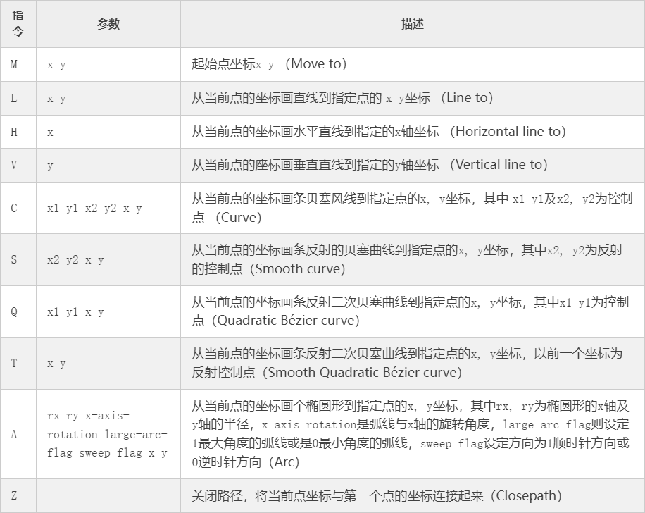
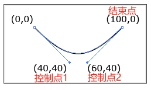
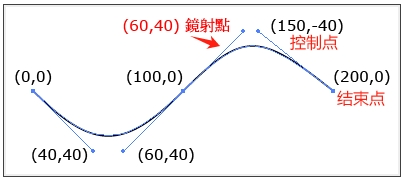
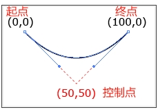
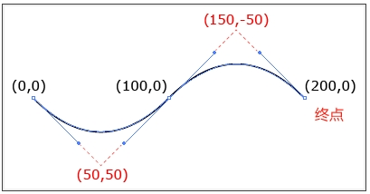

# svg零高容器实战
```
大纲介绍
	视窗与视野回顾
	零高容器
	实战
	
path 路径曲线动画
```

# (1)视窗与视野回顾
```
概念：
  视窗（viewport）：
    浏览器上可视区域，由width和height控制；即SVG元素在浏览器中所占据的实际渲染区域大小。这个区域大小,就是视窗。

  视野（viewbox）：
    是SVG内容的虚拟空间，可以被看作是一个自定义的坐标系统，包含了SVG图形的所有内容，并且允许您定义一个相对于这个坐标系统的裁剪区域。
    viewBox属性以四个数值的形式定义：viewBox="x y width height"，分别表示虚拟坐标系的左上角横坐标、纵坐标以及宽高。当设置了viewBox后，SVG引擎会根据这个坐标区域内的内容按比例缩放，以便适应视窗的大小。同时属性preserveAspectRatio用来在视窗中如何显示viewBox的内容，如viewBox如何缩放适应视窗的大小，同时viewBox在视窗中的位置如何对齐

视窗与视野关系：
  1.如果没有设置viewBox，那么SVG的内容会直接按照视窗的大小进行绘制，所有图形将填满整个视窗。

  2.当设置了viewBox时，SVG内容会被映射到视窗内，不论视窗大小如何变化，viewBox内的内容始终保持其相对比例。
    此外，还可以通过preserveAspectRatio属性来控制视野内容在视窗内如何对齐和填充。若svg标签未设置preserveAspectRatio，则其默认值preserveAspectRatio="xMidYMid meet"。其中xMidYMid表示如何对齐；meet是如何填充，表示保持“宽高比”并将视野viewBox缩放为适合视窗viewport的大小；
    preserveAspectRatio具体说明见以前笔记！！！

案例：视窗与视野关系
<!--
没有设置viewBox,视野上的内容会直接按照视窗的大小进行绘制，所有图形将填满整个视窗。
-->
<svg width="100" height="200" style="background:red;"></svg>
等价于
<svg width="100" height="200" viewBox="0 0 100 200" style="background:red;"></svg>
等价于
<div style="width:100px;height:200px">
    <svg viewBox="0 0 100 200" style="background:red;"></svg>
</div>

<!-- 
表现：浏览器控制台查看svg的height为100，视野的内容相对视窗是“缩小”展示的，以适应视窗
原因：设置viewBox，视窗与视野保持宽高比，因此height为100 
-->
<svg width="50"  viewBox="0 0 100 200" style="background:red;"></svg>

<!-- 
表现：浏览器控制台查看svg的height为200，视野的内容相对视窗是“正常”展示的，以适应视窗
原因：设置viewBox，视窗与视野保持宽高比，因此height为200
-->
<svg width="100" viewBox="0 0 100 200" style="background:red;"></svg>

<!-- 
表现：浏览器控制台查看svg的height为400，视野的内容相对视窗是“放大”展示的，以适应视窗
原因：设置viewBox，视窗与视野保持宽高比，因此height为400
-->
<svg width="200" viewBox="0 0 100 200" style="background:red;"></svg>

<!-- 
【重点】
表现：浏览器控制台查看 svg若没设置width、height, 仅设置了viewBox="0 0 100 200", svg的宽高比始终是1/2
原因：设置viewBox，视窗与视野保持宽高比

在移动端由于设备宽度是有限值的，因此svg在这种场景下相当于【默认】设置了svg的width=100%，可省略不写
-->
<svg viewBox="0 0 100 200" style="background:red;"></svg>
<svg viewBox="0 0 100 200" width="100%" style="background:red;"></svg>
<div style="width:100%">
    <svg viewBox="0 0 100 200" style="background:red;"></svg>
</div>
```

# (2)零高容器

## 零高容器基本结构
```html
<section style="overflow: hidden;">
  <!-- 
    1.零高容器部分 
    特点：style="height:0px;"
  -->
  <section id="dom1" style="height:0px;">
    <section style="height:300px;background-color:rgba(0,0,0,0.3);font-size:20px;font-weight:bold;">
      零高容器内容...
    </section>
  </section>
  <!-- 
    2.展开部分
    特点：
      // transform会触发BFC;BFC一块独立的渲染区域，可以将BFC看成是元素的一种属性，拥有了这种属性的元素就会使他的子元素与世隔绝，不会影响到外部其他元素;
      若是svg、img等标签元素撑开也可以不设置transform css属性
      transform:scale(1);
      // 零高容器部分内容多高就可设置多高
      height: 500px; 
  -->
  <div id="dom2" style="transform:scale(1); height: 500px;background-color:rgba(255,0,0,0.7);">
    <div style="position: absolute;bottom:0;left:0;right:0;font-size:14px">
      <p>表现：通过背景颜色可以看到,dom2是在dom1层级之上的，dom1盒子内容是由dom2盒子撑开</p>
    </div>
  </div>

  <!-- 若是svg、img等标签元素撑开也可以不设置transform css属性 -->
  <!--  -->
</section>
```

## 零高容器与svg动画结合
```html
<section style="width: 345px;margin: 0px auto;">
  <section style="overflow: hidden;">
    <!-- 1.零高容器部分 -->
    <section style="height: 0px;">
      <section style="width:100%;height:500px;border-top: 1px solid red;">
        1.零高容器内容部分...
      </section>
      <section style="width:100%;height:500px;border-top: 1px solid red;">
        2.零高容器内容部分...
      </section>
    </section>
    <!-- 2.展开部分 -->
    <svg 
      style="background:red;cursor:pointer;"
      viewBox="0 0 345 40" 
      xmlns="http://www.w3.org/2000/svg">
      <!-- 将svg背景色去除,零高容器便于查看内容 -->
      <animate attributeName="opacity" from="1" to="0" fill="freeze" dur="0.01s" begin="click"></animate>
      <!-- 方式一动画：瞬间展开 -->
      <!-- <set attributeName="height" from="40" to="1000" restart="never" fill="freeze" begin="click+0.1s"></set> -->

      <!--  方式二动画：线性展开 -->
      <!-- 
        参数说明：
          1.values="参数1; 参数2; 参数3; ..."
            定义动画的多个关键帧，而from 和to来只能定义参数的起始和结束。
          2.keyTimes="参数1; 参数2; 参数3; ..."
            keytimes 在默认的状态下，第一个时间值为0，最后一个时间值为1；是values对应区间的时间分配比。
          3.dur="5s"
            动画的持续时间5s
          
        案例说明：
          svg高度从 40 到 150 动画分配时间为   3*0.15 = 0.45s；
                从 150 到 450 动画分配时间为   3*(0.4-0.15) = 3*0.25 = 0.75s;
                从 450 到 1000 动画分配时间为  3*(1-0.4) = 3*0.6 = 1.8s;
                验证：dur = 0.45s + 0.75s + 1.8s = 3s
      -->
      
      <animate attributeName="height" 
        values="40;150;450;1000" keyTimes="0;0.15;0.4;1" dur="3s"
        fill="freeze" restart="never" begin="click+0.1s">
      </animate> 

      <!-- 
      拓展
        其实上面就是匀速动画calcMode="linear"；相当于
          <animate attributeName="height" 
            calcMode="linear"
            values="40;150;450;1000" keyTimes="0;0.15;0.4;1" dur="3s"
            fill="freeze" restart="never" begin="click+0.1s">
          </animate>
        
        calcMode指的时keyTimes对应values值之间动画运行时的速度控制属性；
        有时候我们我们看到animate元素上设置calcMode="spline"，表示自定义(手动)设置keyTimes对应values值之间的动画速度；
        calcMode="spline"属性值需要和keySplines 属性搭配使用；
        keySplines 属性用于定义各个动画过渡效果的easing函数，其属性值时一组和keyTimes列表值对应的三次贝兹曲线控制点。

        keySplines设置参考：https://cubic-bezier.com
        
        <animate attributeName="height" 
          values="40;150;450;1000" keyTimes="0;0.15;0.4;1" dur="3s"
          calcMode="spline" keySplines=".42,0,1,1; .56,.12,.84,.36; .25,.1,.25,1"
          fill="freeze" restart="never" begin="click+0.1s">
        </animate>
      -->
    </svg>
  </section>
</section>
```

## 零高容器_宽度自适应【重点】

###  基本案例
```html
<style type="text/css">
*{margin:0;padding:0;}
.rich_media_content{overflow:hidden;color:#333;font-size:17px;word-wrap:break-word;-webkit-hyphens:auto;-ms-hyphens:auto;hyphens:auto;text-align:justify;position:relative;z-index:0;}
.rich_media_content *{max-width:100%!important;box-sizing:border-box!important;-webkit-box-sizing:border-box!important;word-wrap:break-word!important;}
</style>

<div class="rich_media_content" style="visibility: visible;">
  <section style="font-size: 0;line-height: 0;">
    <!-- 1.零高容器部分 -->
    <section style="height: 0;">
      <svg viewBox="0 0 880 800" style="display: block;margin-top: -1px;background: url(./1.gif) 0 0 / 100% auto no-repeat;pointer-events: none;user-select: none;-webkit-tap-highlight-color: transparent;"></svg>
      <svg viewBox="0 0 880 800" style="display: block;margin-top: -1px;background: url(./1.gif) 0 0 / 100% auto no-repeat;pointer-events: none;user-select: none;-webkit-tap-highlight-color: transparent;"></svg>
      <svg viewBox="0 0 880 800" style="display: block;margin-top: -1px;background: url(./1.gif) 0 0 / 100% auto no-repeat;pointer-events: none;user-select: none;-webkit-tap-highlight-color: transparent;"></svg>
      <svg viewBox="0 0 880 800" style="display: block;margin-top: -1px;background: url(./1.gif) 0 0 / 100% auto no-repeat;pointer-events: none;user-select: none;-webkit-tap-highlight-color: transparent;"></svg>
      <svg viewBox="0 0 880 800" style="display: block;margin-top: -1px;background: url(./1.gif) 0 0 / 100% auto no-repeat;pointer-events: none;user-select: none;-webkit-tap-highlight-color: transparent;"></svg>
    </section>
    <!-- 2.展开部分 -->
    <svg 
      viewBox="0 0 880 800" 
      style="pointer-events: visible; display: block;
      max-width: none!important;margin-top: -1px;user-select: none;-webkit-tap-highlight-color: transparent;">
      <!-- 
        线性动画
        特征：attributeName="width" values="100%;50%;500%;500%"
		自适应宽度，变化的是 attributeName="width"
      -->
      <animate attributeName="width" values="100%;50%;500%;500%" keyTimes="0;0.15;0.4;1" dur="5s" calcMode="spline" keySplines=".42,0,1,1;.42,0,1,1;.42,0,1,1" begin="click" fill="freeze"></animate>
      <!-- 让svg隐藏,可给svg设置background-color: red;然后查看去除set元素或设置set元素的效果 -->
      <set attributeName="visibility" from="visible" to="hidden" restart="never" fill="freeze" begin="click"></set>
    </svg>
  </section>
</div>
```
### 案例原理
```
特征：attributeName="width" values="100%;50%;500%;500%"

解释为什么改变的是svg的width属性，且最终值为500%？
	1.对于“零高容器”的视野(viewBox="0 0 880 800")内容viewBox-height为 5*800=4000; viewBox-width=880；

	2.对于“展开部分”的视野(viewBox="0 0 880 800")内容viewBox-height为 800; viewBox-width=880；

    3.由于最终达到的目的是将零高容器内容完全显示出来，那么就需要“展开部分” 视窗高度height和宽度width与“零高容器”视窗高度一致
      现在“零高容器”与“展开部分”的viewBox-width都为880，“零高容器”的viewBox-height=4000，而“展开部分” viewBox-height=800；
      “零高容器”的viewBox-height是“展开部分”viewBox-height 的5倍；
      那么相当于“展开部分”视窗的高度height需要增加5倍；

    4.由于“展开部分”的svg视窗与视野的宽高比一致（提示:若不理解，见视窗与视野回顾章节！）；
      当“展开部分”视窗的高度height需要增加5倍；那么视窗的宽度width也需要增加5倍；

      由于“展开部分”的svg元素没有显式设置宽度，则浏览器会根据上下文来决定这个百分比的实际大小。即移动设备的宽度；为100%；
      当“展开部分”视窗的宽度增加了5倍,那么最终值就为500%


注意：微信公众号环境下，需要解除最大宽度限制。即max-width: none!important
  	<svg viewBox="0 0 100 100" style="max-width: none!important;background:red"></svg>
```
### 拓展：pointer-events
```
pointer-events是一个css属性，用于事件穿透场景。常见值如下：
    (1)auto
      默认值，效果和没有定义pointer-events属性相同，鼠标不会穿透当前层。

    (2)none
      元素不再是鼠标事件的目标，鼠标不再监听当前层而去监听下面的层中的元素(即有穿透功能能力)。
    
    (3)visiblePainted
      只适用于 SVG。元素只有在以下情况才会成为鼠标事件的目标：
      visibility属性值为visible，且鼠标指针在元素内部，且fill属性指定了none之外的值
      visibility属性值为visible，鼠标指针在元素边界上，且stroke属性指定了none之外的值

    (4)visibleFill
      只适用于 SVG。只有在元素visibility属性值为visible，且鼠标指针在元素内部时，元素才会成为鼠标事件的目标，fill属性的值不影响事件处理。

    (5)visibleStroke
      只适用于 SVG。只有在元素visibility属性值为visible，且鼠标指针在元素边界时，元素才会成为鼠标事件的目标，stroke属性的值不影响事件处理。

    (6)visible
      只适用于 SVG。只有在元素visibility属性值为visible，且鼠标指针在元素内部或边界时，元素才会成为鼠标事件的目标，fill和stroke属性的值不影响事件处理。

    (7) painted
      只适用于 SVG。元素只有在以下情况才会成为鼠标事件的目标：

      鼠标指针在元素内部，且fill属性指定了none之外的值
      鼠标指针在元素边界上，且stroke属性指定了none之外的值
      visibility属性的值不影响事件处理。

    (8)fill
      只适用于 SVG。只有鼠标指针在元素内部时，元素才会成为鼠标事件的目标，fill和visibility属性的值不影响事件处理。

    (9)stroke
      只适用于 SVG。只有鼠标指针在元素边界上时，元素才会成为鼠标事件的目标，stroke和visibility属性的值不影响事件处理。

    (10)all
      只适用于 SVG。只有鼠标指针在元素内部或边界时，元素才会成为鼠标事件的目标，fill、stroke和visibility属性的值不影响事件处理。
```

**案例一：元素不再是鼠标事件的目标**
```
<ul>
	<li><a href="http://www.baidu.com">可以点击的链接</a></li>
	<li><a href="http://www.baidu.com" style="pointer-events:none">不能点击的链接,且不展示点击手形</a></li>
</ul>
```

**案例二：鼠标不再监听当前层而去监听下面的层中的元素**
```
<style>
  .top { width: 200px;height: 90px;position: absolute;top: 0;left: 0px;background: yellow;opacity: 0.5;}
</style>
<!-- style="pointer-events:none;"增加或删除查看效果 -->
<div style="pointer-events:none;" data-top="上方黄色div" class="top"></div>
<ul>
  <li style="pointer-events:none;"><a href="http://www.baidu.com">百度</a></li>
  <li><a href="http://www.baidu.com">www.baidu.com</a></li>
</ul>
```

**案例三：pointer-events在svg中应用**
```
<style type="text/css">
*{margin:0;padding:0;}
.rich_media_content{overflow:hidden;color:#333;font-size:17px;word-wrap:break-word;-webkit-hyphens:auto;-ms-hyphens:auto;hyphens:auto;text-align:justify;position:relative;z-index:0;}
.rich_media_content *{max-width:100%!important;box-sizing:border-box!important;-webkit-box-sizing:border-box!important;word-wrap:break-word!important;}
</style>

<div class="rich_media_content" style="visibility: visible;">
  <section style="font-size: 0;line-height: 0;">
    <section style="height: 0;">
      <!-- 
        设置 pointer-events: visible; 或 pointer-events: none; 查看效果
      -->
      <svg viewBox="0 0 880 800" style="display: block;margin-top: -1px;background: url(./1.gif) 0 0 / 100% auto no-repeat;
        pointer-events: visible;user-select: none;-webkit-tap-highlight-color: transparent;">
        <rect x="10" y="10" rx="5" ry="5" width="150" height="100" fill="red" stroke="red">
          <set attributeName="visibility" from="visible" to="hidden" restart="never" fill="freeze" begin="click"></set>
        </rect>
      </svg>
      <svg viewBox="0 0 880 800" style="display: block;margin-top: -1px;background: url(./1.gif) 0 0 / 100% auto no-repeat;pointer-events: none;user-select: none;-webkit-tap-highlight-color: transparent;"></svg>
      <svg viewBox="0 0 880 800" style="display: block;margin-top: -1px;background: url(./1.gif) 0 0 / 100% auto no-repeat;pointer-events: none;user-select: none;-webkit-tap-highlight-color: transparent;"></svg>
      <svg viewBox="0 0 880 800" style="display: block;margin-top: -1px;background: url(./1.gif) 0 0 / 100% auto no-repeat;pointer-events: none;user-select: none;-webkit-tap-highlight-color: transparent;"></svg>
      <svg viewBox="0 0 880 800" style="display: block;margin-top: -1px;background: url(./1.gif) 0 0 / 100% auto no-repeat;pointer-events: none;user-select: none;-webkit-tap-highlight-color: transparent;"></svg>
    </section>
    <svg 
      viewBox="0 0 880 800" 
      style="pointer-events: visible; display: block;
      max-width: none!important;margin-top: -1px;user-select: none;-webkit-tap-highlight-color: transparent;">
      <animate attributeName="width" values="100%;50%;500%;500%" keyTimes="0;0.15;0.4;1" dur="5s" calcMode="spline" keySplines=".42,0,1,1;.42,0,1,1;.42,0,1,1" begin="click" fill="freeze"></animate>
      <set attributeName="visibility" from="visible" to="hidden" restart="never" fill="freeze" begin="click"></set>
    </svg>
  </section>
</div>
```
## 零高容器_宽度固定【重点】
```
<style type="text/css">
*{margin:0;padding:0;}
.rich_media_content{overflow:hidden;color:#333;font-size:17px;word-wrap:break-word;-webkit-hyphens:auto;-ms-hyphens:auto;hyphens:auto;text-align:justify;position:relative;z-index:0;}
.rich_media_content *{max-width:100%!important;box-sizing:border-box!important;-webkit-box-sizing:border-box!important;word-wrap:break-word!important;}
</style>

<div class="rich_media_content" style="visibility: visible;">
  <section style="width: 340px;margin: 0 auto; font-size: 0;line-height: 0;">
    <!-- 1.零高容器部分 -->
    <section style="height: 0;">
      <svg viewBox="0 0 880 800" style="display: block;margin-top: -1px;background: url(./1.gif) 0 0 / 100% auto no-repeat;pointer-events: none;user-select: none;-webkit-tap-highlight-color: transparent;"></svg>
      <svg viewBox="0 0 880 800" style="display: block;margin-top: -1px;background: url(./1.gif) 0 0 / 100% auto no-repeat;pointer-events: none;user-select: none;-webkit-tap-highlight-color: transparent;"></svg>
      <svg viewBox="0 0 880 800" style="display: block;margin-top: -1px;background: url(./1.gif) 0 0 / 100% auto no-repeat;pointer-events: none;user-select: none;-webkit-tap-highlight-color: transparent;"></svg>
      <svg viewBox="0 0 880 800" style="display: block;margin-top: -1px;background: url(./1.gif) 0 0 / 100% auto no-repeat;pointer-events: none;user-select: none;-webkit-tap-highlight-color: transparent;"></svg>
      <svg viewBox="0 0 880 800" style="display: block;margin-top: -1px;background: url(./1.gif) 0 0 / 100% auto no-repeat;pointer-events: none;user-select: none;-webkit-tap-highlight-color: transparent;"></svg>
    </section>
    <!-- 2.展开部分 -->
    <!-- 
      问题：展开部分与零高容器部分物理空间如何实现高度一致？
        由于移动端适配问题，宽度不固定，导致svg的高度也不固定；因此固定最外层盒子宽度为width: 340px;
        由于宽度固定，不同设备上高度也就固定了;

        由于视图于视野保持宽高比关系；那么展开部分svg初始高度为：
          svg的宽度为340px；340/svg高 = 880/800 => svg的初始物理空间高度height = 309.09; 即from="309.09" 
        
          零高容器部分高度：
            340/svg高 = 880/(800*5)  => svg高=1,545.4545 => to="1,545.4545"
        
        可通过浏览器调试查看！！
    -->
    <svg 
      viewBox="0 0 880 800" 
      style="pointer-events: visible; display: block;
      max-width: none!important;margin-top: -1px;user-select: none;-webkit-tap-highlight-color: transparent;">
      <!-- 线性动画: 固定宽度，变化的是 attributeName="height" -->
      <animate calcMode="spline" attributeName="height" values="309.09;1545.45;1545.45" dur="4s" keyTimes="0;0.8;1" keySplines=".42,0,1,1;.42,0,1,1" begin="click" fill="freeze"></animate>
      <!-- 让svg隐藏,可给svg设置background-color: red;然后查看去除set元素或设置set元素的效果 -->
      <set attributeName="visibility" from="visible" to="hidden" restart="never" fill="freeze" begin="click"></set>
    </svg>
  </section>
</div>
```
# (3)曲线

## path标签

### 指令


```
在SVG中的<path>元素，可以帮助我们在SVG中绘制任何你想要的形状(基本图形、无规则的图形)，因此path就是具有相当多的指令让使用者来设定。

(1)指令分类
	1.直线命令：在两个点之间画直线；如 H/h、V/v、L/l
	2.曲线命令：用来绘制贝塞尔曲线、弧形或者说是圆的一部分；如 C/c 、S/s、Q/q、T/t、A/a
	3.其他：M/m、Z/z

(2)绝对坐标指令与相对坐标指令
	1.绝对坐标指令用“大写”表示；其中的参数代表绝对坐标，代表的是画笔应移动或绘制到的“精确坐标位置”。
	2.相对坐标指令用“小写”表示；其中的参数代表相对坐标，代表的是从当前点到目标点的“偏移量”，正数就代表向轴正向偏移，负值表示向反向仿移。

(3)指令的书写规范
	方式一: 【推荐】指令之间“空格”隔开；指令后面的纵横坐标使用“空格”区分，多个坐标之间使用“逗号”来隔开
    <path d="M20 20 C90 40, 130 40, 180 20" stroke="#000000" fill="none" style="stroke-width: 2px;"></path>

    方式二: 指令之间“空格”隔开；指令后面的纵横坐标使用“逗号”区分，多个坐标使用“空格”来隔开
    <path d="M20,20 C90,40 130,40 180,20" stroke="#000000" fill="none" style="stroke-width: 2px;"></path>

    方式三: 指令之间、指令后面的纵横坐标、多个坐标之间 都使用“空格” 来隔开
    <path d="M20 20 C90 40 130 40 180 20" stroke="#000000" fill="none" style="stroke-width: 2px;">

    方式四: 指令之间单独放一行，指令后面的纵横坐标、多个坐标之间 都使用“空格” 来隔开
    <path stroke="#000000" fill="none" style="stroke-width: 2px;"
        d="M20 20 
            C90 40 130 40 180 20">
```

### M/m
```
作用：M指令表示起始点，用来指明从何处开始画。类似PS中的钢笔工具，仅仅是移动画笔，但不画线。

格式: Mx y

案例：
	<svg width="300" height="150">
    	<path d="M0 0" stroke="red"/>
    </svg>
```
### H/h
```
作用：用于从当前坐标点绘制“平行于X轴”的直线。

格式: Hx

案例：画了一条(0,10)到(100,10)平行于x轴的直线。
	<svg width="300" height="150">
    	<path d="M0 10 H100" stroke="red"/>
    </svg>
```
### V/v
```
作用：用于从当前坐标点绘制“平行于Y轴”的直线。

格式: Vy

案例：画了一条(10,0)到(10,100)平行于y轴的直线。
	<svg width="300" height="150">
    	<path d="M10 0 V100" stroke="red"/>
    </svg>
```
### L/l
```
作用：用于从当前坐标点绘制到某个点的直线。

格式: Lx y

案例：
	<svg width="300" height="150">
    	<path d="M0 10 L100 10" stroke="red"/>
		<path d="M10 0 L10 100" stroke="red"/>
		<path d="M10 10 L100 100" stroke="red"/>
    </svg>
```

### Z/z
```
作用：Z命令会从当前点画一条直线到路径的起点，尽管我们不总是需要闭合路径，但是它还是经常被放到路径的最后。

格式: Z  无参数

案例：
	<svg width="300" height="150">
    	<path d="M10 10 L10 100 L100 100 Z" stroke="red"/>
    </svg>
```

### 案例：直线命令综合运用
```
案例：绘制一个正方形边框
<svg width="100" height="100"> 
    <path d="M10 10 H 90 V 90 H 10 L 10 10" stroke="red"/>
    
    <!-- 使用指令Z简化 -->
    <!-- <path d="M10 10 H 90 V 90 H 10 Z" stroke="red" /> -->
    
    <!-- 使用相对坐标指令表示，特点：小写，值表示偏移量 -->
    <!-- <path d="M10 10 h 80 v 80 h -80 Z" stroke="red"/> -->
    
    <circle cx="10" cy="10" r="2" fill="red"/> 
    <circle cx="90" cy="90" r="2" fill="red"/> 
    <circle cx="90" cy="10" r="2" fill="red"/> 
    <circle cx="10" cy="90" r="2" fill="red"/> 
</svg>
```

### C/c
```
作用：用于绘制“三次”贝塞尔曲线

格式: C x1 y1, x2 y2, x y
	x1 y1 表示三次贝塞尔曲线的第一个控制点
	x2 y2 表示三次贝塞尔曲线的第二个控制点
	x y	  表示三次贝塞尔曲线的结束点
	
案例：
	<svg width="300" height="150">
    	<path d="M0 0 C40 40,60 40,100,0" stroke="red" fill="none"/>
    </svg>
```


### S/s
```
作用：S可以在原本的点后方建立一个带有贝塞尔曲线控制点的点，然后原本的点会以同样的曲线斜率镜射一个贝塞尔曲线控制点（对称关系）。

格式: S x2 y2, x y
	x2 y2 表示贝塞尔曲线的第二个控制点；控制点x1 y1就是图中的镜射点
	x y	  表示贝塞尔曲线的结束点

案例：
	<svg width="300" height="150">
    	<path d="M0 0 C40 40,60 40,100,0 S150 -40, 200 0" stroke="red" fill="none"/>
    </svg>
```


### Q/q
```
作用：用于绘制“二次”贝塞尔曲线，起点和终点的贝塞尔曲线共用同一个控制点，只需要有贝塞尔曲线控制点的坐标和终点坐标就可以。

格式: Q x1 y1, x y
	x1 y1 表示贝塞尔曲线的第一个控制点
	x y	  表示贝塞尔曲线的结束点
	
案例：
	<svg width="300" height="150">
    	<path d="M0 0 Q50 50, 100 0" stroke="red" fill="none"/>
    </svg>
```


### T/t
```
作用：T只有一组参数x,y，表示终点的坐标，所以T的前方要接上Q才能画出对应的坐标线。

格式: T x y
	x y	  表示贝塞尔曲线的结束点
	
案例：
	<svg width="300" height="150">
    	<path d="M0 0 Q50 50, 100 0 T200 0" stroke="red" fill="none"/>
    </svg>
```


### A/a
```
作用：用于绘制椭圆圆弧(Arcs)

格式: Arx ry, x-axis-rotation large-arc-flag sweep-flag x y
    rx：椭圆在x轴的半径（根据不同的终点换算成比例）
    ry：椭圆在y轴的半径（根据不同的终点换算成比例）
    x-axis-rotation：弧线与x轴的旋转夹角
    large-arc-flag：
		1表示大角度弧线，0表示小角度弧线（必须有三个点）
    	如果设为 1，则会选择大于180度的那个弧线；若设为 0，则会选择小于等于180度的那个弧线。
    sweep-flag：1为顺时针方向，0为逆时针方向
    x：终点x坐标点
    y：终点y坐标点

案例：
	<svg width="300" height="300">
    	<!-- 1.弧形:起点(260,100) x,y轴半径比例:rx/ry=260/200=13/10、小角度弧线、逆时针 -->
        <path d="M260 100 A100 20 0 0 0 260 200" stroke="red" fill="none"/>
        <!-- 2.弧形:起点(260,100) x,y轴半径比例:rx/ry=260/200=13/10、小角度弧线、顺时针 -->
        <!-- <path d="M10 100 A100 20 0 0 1 10 200" stroke="red" fill="none"/> -->
        <!-- 3.弧形:起点(260,100) x,y轴半径比例:rx/ry=260/200=13/10、大角度弧线、顺时针 -->
        <!-- <path d="M10 100 A100 20 0 1 1 10 200" stroke="red" fill="none"/> -->
    </svg>
    
    <svg width="300" height="300">
        <!-- 大角度 ( 黑色线 ) -->
        <path d="M0 0 L50 50 A50 50 0 1 0 100 0" stroke="#000" fill="none"/>
        <!-- 小角度 ( 红色线 ) -->
    	<path d="M0 0 L50 50 A50 50 0 0 0 100 0" stroke="#f00" fill="none"/>
    </svg>
```

## 贝塞尔曲线
```
在动画中，贝塞尔曲线用于定义物体运动的轨迹或属性变化的速率曲线。

三次贝塞尔曲线
	若起点是0,0; 终点是1, 1;那么SVG、 Canvas、CSS3动画分别表示为:
        SVG:
            <path d="M0 0 C x1 y1, x2 y2, 1 1"/>
            
        Canvas:
            ctx.moveTo(0,0);
            ctx.bezierCurveTo(x1,y1,x2,y2,1,1);
            
        css3:
            cubic-bezier(x1,y1, x2,y2)
     
     其中x1,y1就是(0,0)头上插的天线的端点坐标，x2,y2就是(1,1)头上插的天线的端点坐标。
```

## animateMotion标签
```
animateMotion 大致的属性和 animate 差不多，不过，它还拥有自己特有的属性，比如 keyPoints、rotate、path 等。不过，calcMode 在 AM(animateMotion) 中的默认属性由，linear 变为 paced。

rotate属性：
	auto：让物体垂直于路径的切线方向运动。不过，如果你的路径是闭合曲线的话，需要注意起始点的位置。
	auto-reverse：让物体垂直于路径的切线方向并 +180°。也就是和 auto 运动关于切线对称。
	Number：让物体以固定的旋转角度运动。这个就相当于使用 transform:rotate(deg) 进行控制。

案例1：简单路径： 路径由 from、to 属性指定起点和终点
<svg width="300" height="300" style="border:1px solid black">
  <rect x="0" y="0" width="30" height="30" fill="red">
    <animateMotion from="0,0" to="60,30" dur="4s" fill="freeze"/>
  </rect>
</svg>

案例2：复杂路径： 路径由 path 属性指定，用法和 path 标签中 d 属性是一样的
<svg width="300" height="300" style="border:1px solid black">
  <rect x="0" y="0" width="30" height="30" fill="red">
    <animateMotion path="M50,125 C 100,25 150,225, 200, 125" dur="4s" fill="freeze"/>
  </rect>
</svg>

案例3：使用 mpath 标签,引用外部的path
<svg width="300" height="300" style="border:1px solid black">
  <path d="M10,110 A120,120 -45 0,1 110 10 A120,120 -45 0,1 10,110" stroke="lightgrey" stroke-width="2" fill="none" id="theMotionPath"/>
  <circle cx="10" cy="110" r="3" fill="lightgrey" />
  <circle cx="110" cy="10" r="3" fill="lightgrey" />
  <circle cx="" cy="" r="5" fill="red">
    <animateMotion dur="6s" repeatCount="indefinite">
      <mpath xlink:href="#theMotionPath"/>
    </animateMotion>
  </circle>
</svg>
注意：一般而言我们在定义 animateMotion动画 的路径的时候，只用一种方式定义即可，否则会发生相应的覆盖：mpath>path>values>from/to
```
## 案例：物体沿svg路径的动画
```

```

```html
利用css进行改写：
	offset-path：offset-path 是一个 CSS 属性，它表示元素的“运动路径”；
	offset-distance：同样是一个 CSS 属性，定义了元素在路径上运动的距离，单位是数值或百分比；
	
<style>
svg {width: 300px;display: block; position: absolute;/*BFC*/}
.ball {
  width: 10px; height: 10px; background-color: red; border-radius: 50%;
  offset-path: path('M10 80 Q 77.5 10, 145 80 T 280 80');
  offset-distance: 0%;
  animation: red-ball 2s linear alternate infinite;
}
@keyframes red-ball {
  from { offset-distance: 0%; }
  to { offset-distance: 100%; }
}
</style>
<svg width="300px" height="175px">
  <path d="M10 80 Q 77.5 10, 145 80 T 280 80"
    stroke="#888888" stroke-width="1" fill="transparent"></path>
</svg>
<div class="ball"></div>
```

## 案例：svg路径动画
```

```

# (4)实战案例
## 基本结构
```
根据页面dom结构推断出其是 【宽度自适应的零高容器】；根据原理推理：
	<svg viewBox="0 0 1125 1360"></svg> “视野”默认展开高度是1360；
    由于零高容器的内容“视野”宽度都相等是1125，总高度是20151；视野高度比就是20151/1360=14.8169倍数;
    那么展开部分的“视窗”宽度就是
      <set attributeName="width" from="100%" to="1482%" restart="never" fill="freeze" begin="click"></set>
      
      
思考：零高容器的宽度固定如何理解？
```

## 展开部分说明
```
（a）验证svg保持宽高比；通过查看浏览器控制台验证
	1.假设设备宽度为320,那么初始渲染区域高度为：
		h/320 =  1360/1125 -> h=(320*1360)/1125 = 386.8444444444444
				
	2.执行第一个动画svg宽度增大2.64倍，那么320*2.64 = 844.8；
    	由于需要实现宽高比一致，高度也需要增大2.64倍数，386.84*2.64= 1021.2576；
    	
	3.依次推断....

（b）动画
	begin="-2"意味着动画将在文档加载完成后的“2秒前”启动。
    后续begin属性规律
    	1.5 + 10 = 11.5 + 2
    	13.5 + 9 = 22.5 + 2
    	24.5 + 15 = 39.5 + 2
    	....
```

## 零高容器部分
```
<section style="overflow: hidden;">
  <section id="dom1" style="height:0px;">
    <section style="height:300px;background-color:rgba(0,0,0,0.3);font-size:20px;font-weight:bold;">
      零高容器内容...
    </section>
  </section>

  <div id="dom3" style="transform:scale(1); height:0px;">
      <div style="height:400px;background-color:rgba(255,255,0,0.8)">
          dom3
      </div>
  </div>
  
  <div id="dom2" style="transform:scale(1); height: 500px;background-color:rgba(255,0,0,0.7);">
    <div style="position: absolute;bottom:0;left:0;right:0;font-size:14px">
      <p>表现：通过背景颜色可以看到,dom2是在dom1层级之上的，dom1盒子内容是由dom2盒子撑开</p>
    </div>
  </div>
</section>
```